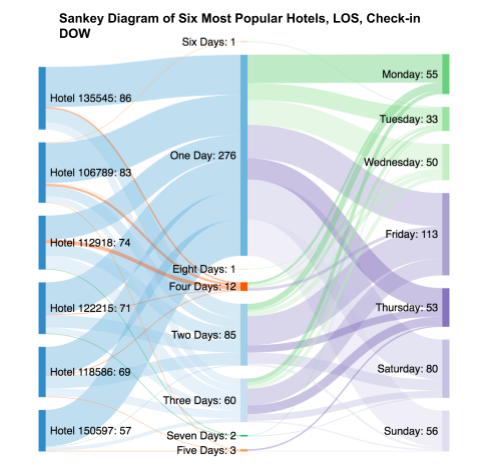
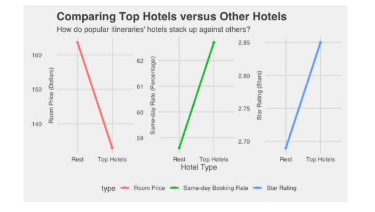
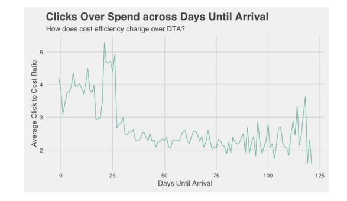
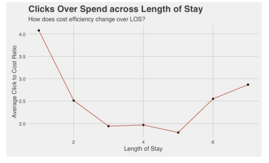
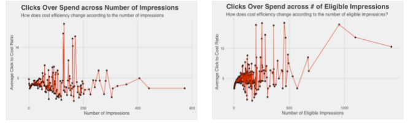
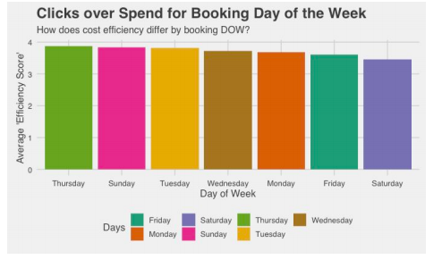
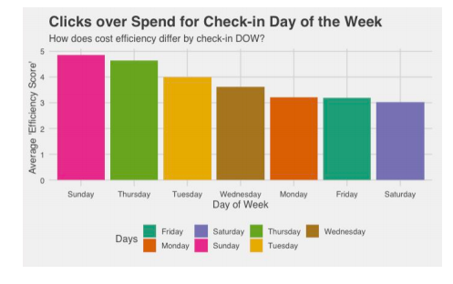
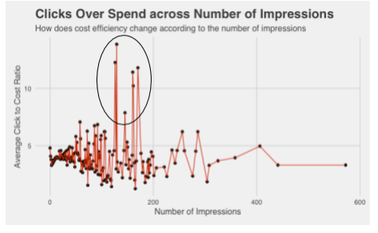

# Snaptravel

In this repository are the code and the PDF for a case study project I did for SnapTravel, a tech travel company committed to helping users save on hotel reservations. In this project, I created numerous graphs using the ggplot package in R as well as performed extensive analysis using cost and reservation datasets from SnapTravel

## 1. What types of itineraries are popular? Within our popular itineraries, what key trends are you seeing?

In order to identify which types of itineraries are popular, I first sorted the Hotel IDs by
occurrence in the bookings dataset. I looked at the six most booked Hotel IDs, which consisted
of 26% of all itineraries: these IDs were 135545, 106789, 112918, 122215, 118586, and 150597.

Using these six hotels, I organized the dataset into a Sankey Diagram to examine the flow
of these hotels into other variables such as Length of Stay (LOS) and Date of Check-in
(CHECK_IN_DOW). This was with the purpose of identifying key trendings within popular
itineraries Here is the Sankey Diagram below:

From these six hotels, guests most commonly stay at one of the most popular locations
for one day (62.7% of the time), followed by two and three day stays (19.3% and 13.6%
respectively). Moreover, using these particular itineraries, a large amount of guests choose to
check-in on Fridays, Saturdays, or Sundays, which make up more than a majority of the
bookings from these six popular hotels (56.7%).

Sure enough, these findings were consistent with the rest of the data as two of the top
three combinations between Hotel ID, LOS, and Check-in DOW consisted of a one-day stay at
one of the top six hotels on a weekend (Hotel 122215, LOS: 1, Check-in DOW: Saturday &
Hotel 150597, LOS:1, Check-in DOW: Sunday). I found these combinations using the ddply
function in the plyr package.

Moreover, among these six highly-booked hotels, customers were more likely to book on
the same day (indicating a DTA of 0) compared to the itineraries of all the other locations. The
same day booking rate among these six popular hotels was 62.7% compared to 58.6% of the
other itineraries. Additionally, the star rating of these popular itineraries was on average higher
than that of the other hotels (2.85 vs. 2.69). However, though the popular hotels are rated higher
on average, they are cheaper than hotels of other itineraries by an average of nearly 31 dollars.
This holds true to the eye test as cheaper and higher-rated itineraries are more likely to be
frequented at a higher rate.

## 2. Our goal for spending money is to maximize the amount of clicks while minimizing the amount of spend. With this in mind, where should we increase spend? Where should we decrease spend?

To examine the efficiency of spending on garnering clicks, I filtered the spend dataset to
examine the rows that had accumulated one or more clicks. For those particular rows, I
calculated a “clicks to cost ratio” variable by dividing the amount of clicks by the spend variable
in order to find trends among maximizing clicks while minimizing spending.

The top hotels (IDs such as 1038845, 544691, 270871) achieved click to cost ratios on
average in the upper 20s to lower 30s, making them nearly three times as large as hotels with the
lowest average click-to-cost ratios (IDs such as 127018, 543972, 188742). Thus, Snaptravel
should increase spend when consumers are looking at the hotels with the highest average
click-to-cost ratio and decrease spend regarding hotels with the lowest average click-to-cost
ratios.

Next, looking at the relationship between average click-to-cost ratio with Days Until
Arrival, we can see that Snaptravel gains more clicks per spending when customers book closer
to their itinerary date, primarily in the 0 to 25 day range. Thus, we should try to increase spend
when consumers browse dates within their range and decrease spend when it exceeds the
range.

As for Length of Stay, Snaptravel gathers the most clicks per cost when the LOS is either
on the shorter side or the longer side, but the average click-to-cost ratio actually dips when the
LOS is in the 3-5 day range. It is true, however, that Snaptravel receives the most clicks per stay
when length of stay is one day, meaning that it is advisable to increase spend when consumers
are planning one day itineraries. Take a look at the graph below:

Looking at the relationship between average click-to-cost ratio with number of
impressions, there was a relative consistency in average click-to-cost ratio with the exception of
a spike between 100 and 200 impressions. It might be worthwhile for Snaptravel to capitalize
by spending to achieve impressions in this range. As for average click-to-cost ratio and
eligible impressions, there seems to be a higher click to cost ratio for itineraries where the
amount of eligible impressions exceeds 300. For both of these graphs, the click to cost ratio
was on the lower end where the impressions or number of eligible impressions was low and it is
advisable to reduce cost for these aspects.

When looking at the relationship between average clicks over spend and Booking DOW,
we can see that days such as Thursday and Sunday rate higher than days such as Friday or
Saturday, though it is by a slim margin. Snaptravel should increase spend when customers
use the tool on Thursday or Sunday and decrease spend on Friday and Saturdays.

As for average click-to-cost ratio and Check-in DOW, the margins are larger, as Sundays
and Thursdays serve as more successful days of Check-in than Fridays, Saturdays, and Mondays
do. Snaptravel should decrease spending when customers choose a check-in date of Friday,
Saturday, or Monday and increase for Sundays and Thursdays.

## 3. What’s an interesting insight from the data that you’d like to dive deeper on?

One insight from the data I would like to dive deeper into is whether the high
click-to-cost ratios for the data points with impressions in the 100-200 range is significant or not.
Let’s take a look at this particular graph again:

If I had not looked at the graph prior, I would have likely thought that data points with
larger numbers of impressions would bring in more clicks. While this may be the case, it appears
that those with large amounts of impressions are not as efficient cost-wise in bringing a large
amount of clicks. It may be that the 100-200 range serves as the relative maximum in terms of
where impressions bring in the most amount of clicks per spend.

While a traditional A/B experiment might not be the most apt to test this as A/B tests
usually consist of testing two different variants of a product, we could apply the same concept of
hypothesis testing to look at the difference of average click-to-cost ratio between impressions in
the 100-200 range and impressions in the 200+ range. Once we have a dataset that includes many
more points to ensure that we are drawing from nearly normal distributions, we can perform a
two-sample hypothesis test to check whether our hypothesis that the average click-to-cost ratios
for these two groups are equivalent or not.
